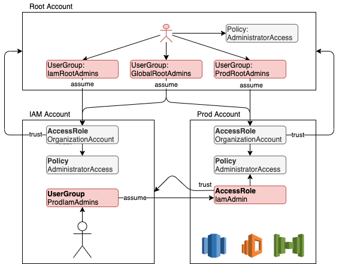

# Blueprint AWS accounts deployment using Terraform

User management in AWS can be a hurdle when using multiple accounts, with API keys and password stored everywhere.
Instead, this repository provides a Terraformed blueprint to centralize the user in a single "IAM" account, and grant
access from there to other accounts and resources.



#### Root account
the root account only welcomes very few users. Using this module, they can be granted
* Admin access to the root account. (TODO)
* Admin access to all the other org account, via the *GlobalRootAdmins* user group
* Admin access to given other accounts, via the dedicated *XxxRootAdmins* user groups

Access to other accounts is granted when the user assumes the `OrganizationAccountAccessRole` created by default by AWS

#### IAM account
The IAM account is the home of all the users and centralizes the access right distribution.
Users are assigned to group that are allowed to assume roles in other accounts. A single API key and secret couple
can therefore be used to execute operations on any account, only assuming different roles.

#### Xxx account
At least one `IamAdminAccessRole` is being created in every account with Admin access policy attached and trusting the
IAM account. `XxxIamAdmins` user group can therefore be created in the IAM account to grant
admin access in the "Xxx" account.

Resources are only being created in those accounts, offering a clear clusterisation between users
and resources.

## Usage
Deploy this module with a user in the root account or assuming a role in there.
```tf
module "accounts" {
  source = "git::https://github.com/widespot/terraform-aws-accounts.git"

  accounts = {
    Prod = {
      email = "aws.prod@widespot.be"
    },
    Dev = {
      email = "aws.dev@widespot.be"
    }
  }

  iam_account_email = "aws.iam@widespot.be"

  # the username of the current root user
  global_root_admin_users = ["root"]
}
```
and 
```
terraform apply
```

### Troubleshooting "creating account"
```
Error creating account: AWSOrganizationsNotInUseException: Your account is not a member of an organization.
```
**Solution:** The email address of the master account must be verified.

### Account population
**[Unfortunately, Terraform doesn't provide a way to automate the creation of the `IamAdminAccessRole` in the managed
accounts](#cross-account-terraform-loop-limitation)**. A second step must therefore be manually be initiated for each
account, using the second module provided

```tf
module "prod_account" {
  source = ""

  account_id = module.accounts.account_ids[0]
}

module "dev_account" {
  source = ""

  account_id = module.accounts.account_ids[1]
}
```

--- 

## Cross account Terraform loop limitation
The blueprint creation of an account requires to execute actions on two accounts
* Creation of the new account, using the root account identity
* Population of the new account, using an identity or a role within that new account

There is unfortunately no Terraform way to declare a provider based on values in a list.
While the creation of the account can be automated from a list of `name`+`email`,
the later population of the account created can't be automated.

### Provider within module limitation
The ideal solution is to have a single module to both create the account and populated it.
The creation would be deployed using a default provider, and the population could
be executed using the same root user but assuming the `OrganizationAccountAccessRole` in the newly created account
```tf
resource "aws_organizations_account" "account" {
  name  = var.account_email
  email = var.account_email
}

provider "aws" {
  alias = "new_account"
  assume_role {
    role_arn = "arn:aws:iam::${aws_organizations_account.account.id}:role/OrganizationAccountAccessRole"
  }
}

resource "aws_iam_role" "iam_admin_access_role" {
  provider = "aws.new_account"

  assume_role_policy = jsonencode({
    "Version": "2012-10-17",
    "Statement": [
      {
        Effect= "Allow",
        Principal= {
          "AWS": "arn:aws:iam::${var.iam_account_id}:root"
        },
        Action= "sts:AssumeRole"
      },
    ]
  })
}
```

Unfortunately, providers can't be declared within a module that is being executed in a loop

> A module intended to be called by one or more other modules must not contain any provider blocks. A module containing its own provider configurations is not compatible with the for_each, count, and depends_on arguments that were introduced in Terraform v0.13
> [Terraform doc](https://www.terraform.io/docs/language/modules/develop/providers.html)

### Loop provider declaration limitation
The alternative is to
1. Create the accounts using a loop on a first module
2. Loop declare the providers in the parent module
3. Loop populate the accounts [passing providers explicitly](https://www.terraform.io/docs/language/modules/develop/providers.html#passing-providers-explicitly) using a second dedicated module

Unfortunately, [providers can't be declared in a loop](https://github.com/hashicorp/terraform/issues/19932)
